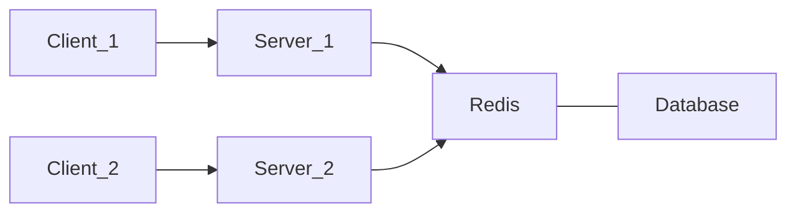

# Cache for read

# Update Cache on Writes
## Write through Cache
Have the cache and DB in sync when there is a write. Downside is that it takes time.

## Write back Cache
The server updates only the cache upon a write, then goes back to client. This makes the cache out of sync with the Database. The system will asynchronously update the DB. At every intervals, or when the cache is filled up (when you need to `evict` the cache).  

Downside: if something happens to the cache, before there is a write to DB, then you may loose data.

# What happens if we have many servers that do caches ?
The first client writes a comment, it is cached to Server 1 and saved in DB. Client 2 reads the comment from another server 2, this server 2 caches the comments.  
The first clients updates the comment. How do we make sure the client 2 gets the new comments that is still cached in server 2 as the old text ? Caches can become `stale` if they have not been updated properly.

For example, a solution would be to have a single cache (like [[Redis]]) out of the servers, that would be the single source of truth. 

For some features, we may not care about `staleness`, for example view count on youtube videos.

# When to use cache
If you deal with data that is immutable, caching is easy and great. If the data is mutable, that is a big work. 
- using Cache is you use immutable data. 
- If you have a single thing that read / write data then we can use cache
- If you don't care about consistency / staleness of data, you can use caching
- If you are able to design your system to get rid of stale data (in a distributed manner if your system uses it) then you can use cache

# Cache eviction
You cannot store infinite data, or you have stale data, you need to get rid of data in Caches (`eviction`).   
Using schedules / policies:
- LRU: Get rid of the Least Recently Used data in cache. 
- Least frequently used: Remove the least frequently used
- LIFO or FIFO
- Randomly
- Every day