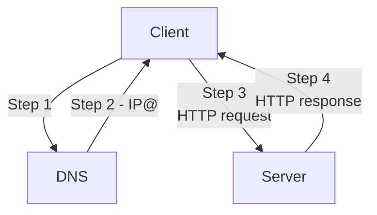

```mermaid
graph TD
Client
Server
DNS

Client -- Step 1 --> DNS
Client --  Step 3 <br> HTTP request --> Server
DNS -- "Step 2 - IP@" --> Client
Server -- Step 4 <br> HTTP response --> Client
```

Server are waiting for requests from clients. Server licenses to requests on Ports. There are 16000 ports to listen to.
- HTTP uses port 80
- HTTPS uses port 443
- 