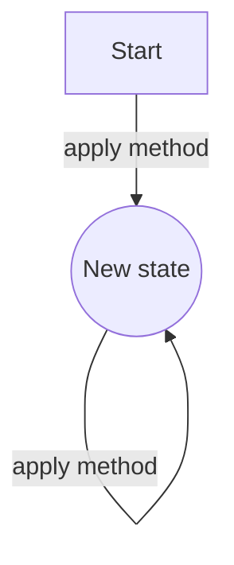

An Operation that has the same ultimate outcome regardless of how many times it's performed. For example buying 5 times the same item should only charge the user once. Operations performed through a [[Publish-Subscribe Pattern|Pub/Sub]] messaging system typically have to be idempotent, since Pub/Sub systems tend to allow the same messages to be consumed multiple times..

