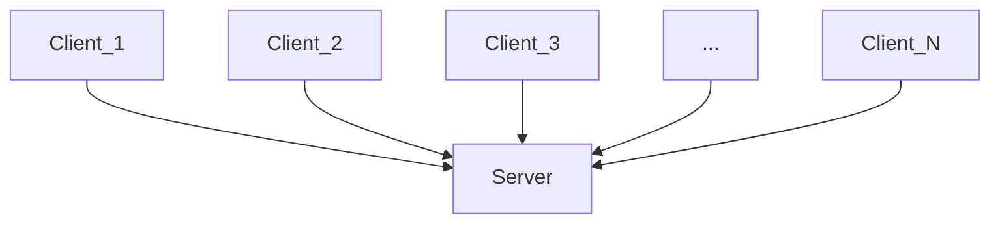

Measure of performance of a system

# Latency
how long it takes for data to go through a system. 
	- network request  from client to server and back to client.
	- Time taken to read data:   
		reading 1MB from memory: $2~\micro\text{seconds}$   
		reading 1MB from SSD: $1000 ~\micro \text{ seconds}$  
		reading 1MB from 1GB/s network : $10,000 ~\micro \text{ seconds}$  
		reading 1MB from HDD : $20,000 ~\micro \text{ seconds}$  
		send a packet from California to Netherlands and back : $150,000 ~\micro \text{ seconds}$
		

# Throughput
How much data can be send through the system over a given amount of time.

How to optimize for throughput: you can party for it to increase the number of servers.

Latency and Throughput are not correlated.