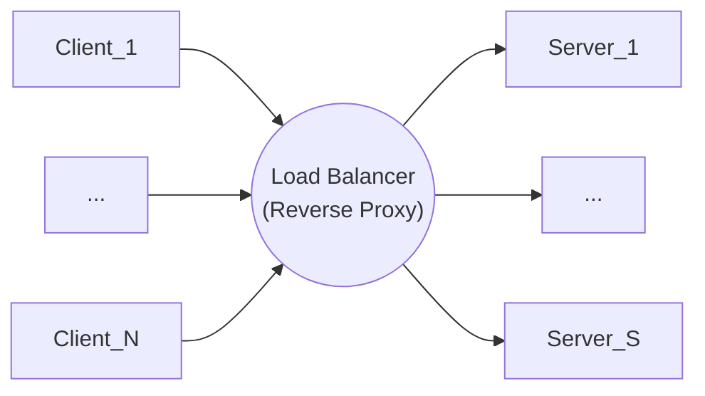
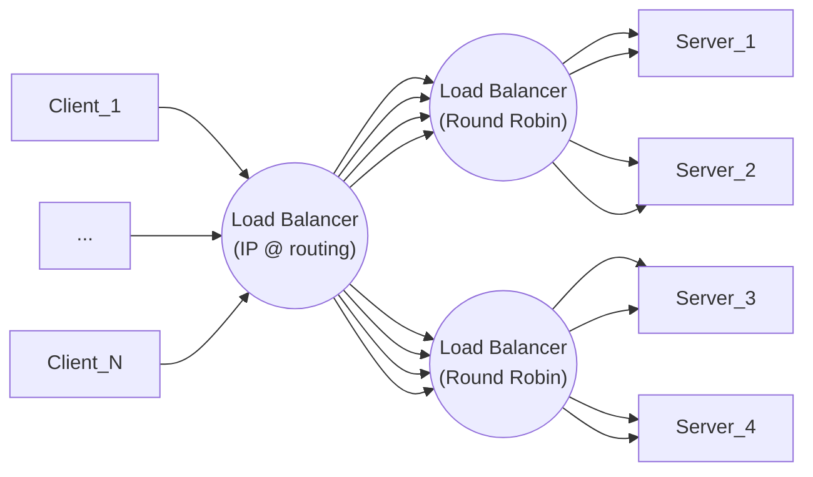

This is a server that can distributes loads between a bunch of servers.

# How does the load balancer work ?
There are Software vs hardware load balancer. The software has more customization and scaling capability. Here we will talk about software load balancer.

## How does a LB has a new server to route to ?
Adding a new server will register itself to the LB

## How do we select the server to send to ? 
- Pure random redirection.
- Round Robin approach: goes through server from top to bottom and come back to first one.
- Weighted Round Robin: Still go through the first to the last server, but redirects more traffic or less depending on the weight. This would be useful if you have some more powerful servers 
- Using health checks, the LB can identify which server is struggling.
- IP based LB: using a hash of the IP address of the client gets routed to a given server. This is useful when you have caching, because all the request of this client are going to the same server, this improves cache hits.
- Cache based strategy: all the request related to a given path in the URL go to a given server. Useful if we want to deploy a big change to a given path, this change will only impact the servers that support this part of the path. All other services on the platform are unaffected in case of failure of deployment.

## Using multiple LB
It makes sens to have multiple LB.

For example one LB using IP @, followed by LB following round robin

## Redundant LB
You can have multiple load balancer to help in case of failure of a LB server. These servers communicate btw each other.

# Tools
**Nginx**