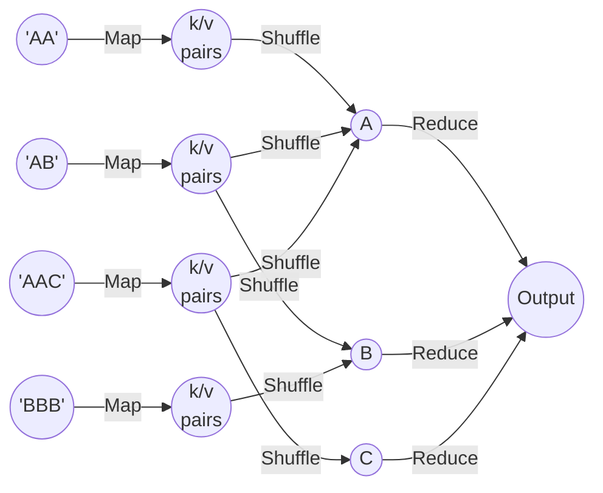

MapReduce is based on the assumptions that most data processing tasks can be split up into a `map` and a `reduce` functions.

Do not forget, there is a `Shuffle` step between the Map and Reduce step !
# Important points
1. When dealing with MapReduce model, we assume we have a distributed file system. And the distributed FS has knowledge of where the data chunks reside and how to communicate with the machine that are going to apply the Map Operation (the `workers`).
2. Because we have large dataset, we do not want to move the data, we move the Map operation (the map program) on the machines that contains the data.
3. The Key-value pair after a Map operation is very important. The Reduce step relies on the Key to "reduce" / aggregate the data.
4. MapReduce handles failures by re-doing a Map or Reduce operation. Hence our Map and Reduce functions are [[Idempotent Operation| idempotent]] !  (they do not change an external state)
5. As an engineer dealing with a MapReduce job, what we care about is specifying Map and Reduce functions and their inputs / outputs.
# Reference
[MapReduce original white Paper](https://static.googleusercontent.com/media/research.google.com/en//archive/mapreduce-osdi04.pdf)
