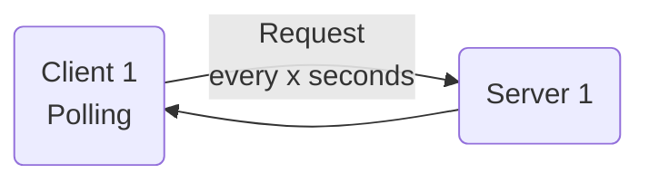
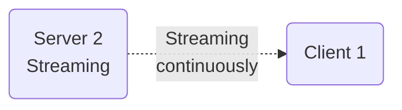

# Polling

Have a client issue a request at every time interval.

# Streaming

The Server opens a [[Socket]] on the client.  
Streaming is pushing data from your server to the client. Whereas polling requires the client to initialize the data exchange with a request.
Streaming allows to have instantaneous information flow without having many request being done by clients.