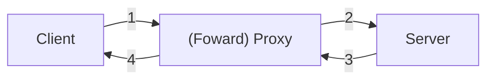
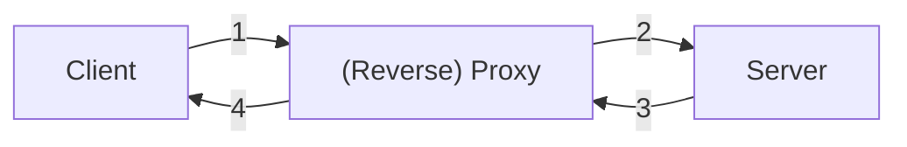

There are `Forward` and `Reverse` proxies. By default a proxy is a forward proxy.

# Forward Proxy
A Forward Proxy (FP) is a server that is between a client (or a set of clients) and another server (or a set of servers). A FP is a server that acts on behalf of client(s). A FP is on the client's side. If a client wants to communicate with a server, when a client issues a request to the server, it goes to the proxy and the proxy forwards the request to the server. The server gets the request from the FP, when the server responses, it replies to the proxy and the proxy sends the replies to the client.

So to the server, the server does not know the IP of the client, but the proxy only.

# Reverse Proxy
A Reverse Proxy (RP) acts on behalf of a Server. If a client wants to send a request to a server, if the RP is set up properly, the RP will get the requests (while the clients thinks its going to the server). 

The key thing is that the client **THINKS** that it is communicating with the server. This is the difference with FP.

RP are very useful. For example a RP can filter out request you want to ignore. it can log / collect metrics, cache html pages. 
one of a best use case is to do [[Load Balancer | load balancing]].