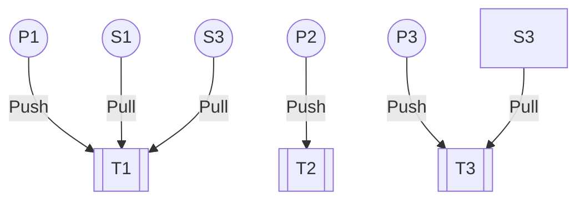

4 entities:
- `Publishers`: Servers publishing data (in the form of messages) into Topics.
- `Subscribers`: Clients that subscribes to Topics.
- `Topics`: Conceptual Channels of specific information.
- `Message`: Represents the data that is relevant to the Subscriber to get/process.

This is closely related to [[Polling and Streaming|Streaming]].

A Pub/Sub system is like a DB. You are guaranteed at **least once** delivery to a subscriber. This can lead to issues where the same message is send multiple times to the same server. This issue enforces the subscriber to have [[Idempotent Operation]].

### Additional property:
- Messages are send to Subscribers in the same order as they come in. This is the behavior of a queue.
- It is possible to "replay" messages.

### Why do we need multiple topics ? 
Pub/Sub is like a Database, which means that we may want to have multiple "tables" (as in SQL). So for each type of data, we want to have multiple topics. These topics have different sets of subscribers.

# Tools
- Apache Kafka
- Google Cloud pub/sub: Topics scales automatically, sharding at a topic level is handled automatically.
