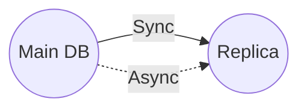

A system's performance is often only as good as its database's; optimize the latter, and watch as the former improves in tandem!

# Replication
If the DB goes down, the system is down as well because we cannot read from DB. To solve for this, we can have a duplicate / replica of the original DB, this is a standby of the real DB. The main DB ensures the replica is up to date.

How to we keep the replica up to date ?   
## Synchronous update
Whenever there is an update of the main DB, the replica is updated synchronously. If the replica update fails, the write command fails for the main DB fails as well.

We can also use replication to improve the latency of the DB.

## Async update
It is possible to update the replica asynchronously. This is ok if we do not need the replicas to be super up to date (like Linkedin posts).

# Sharding
To improve [[Latency and Throughput|throughput]] you can increase the replicas of a DB but this is limiting if the database if huge. So you may want to replicate specific subset of the data. Splitting the data across databases. Partitioning the data (this splitting) is known as **sharding**.

How do you know how to split the data and where to put it ?  
For example with tables, you can split up certain rows into different shards, for example by customer name.

## Hotspots
Some shards may get more traffic than other just by chance.  
You use hashing function to determine what shard a piece of data is gonna be written to and read from. [[Consistent hashing]] may be useful here, depending on the problem.

This logic of choosing how to do the sharding, you could implement it in the server that does the service itself. But in practice, this logic is implemented in a [[Proxies|Reverse Proxy]] that acts on behalf of the DB.

# References
[Azure sharding doc](https://docs.microsoft.com/en-us/azure/architecture/patterns/sharding)