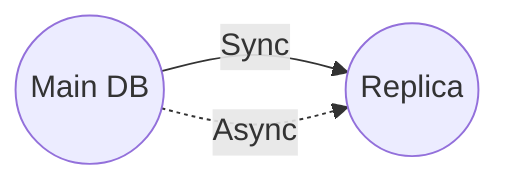

> [!tldr] Replication
> Keeping a copy of the same data on several different nodes, potentially in different locations. Replication provides **redundancy**: if some nodes are unavailable, the data can still be served from the remaining nodes. Replication can also help improve performance.
> From Design Data-intensive apps

This mechanism goes hand in hand with [[Sharding or Partitioning|Sharding]].

A system's performance is often only as good as its database's; optimize the latter, and watch as the former improves in tandem! 

# Replication
If the DB goes down, the system is down as well because we cannot read from DB. To solve for this, we can have a duplicate / replica of the original DB, this is a standby of the real DB. The main DB ensures the replica is up to date.

How to we keep the replica up to date ?   
## Synchronous update
Whenever there is an update of the main DB, the replica is updated synchronously. If the replica update fails, the write command fails for the main DB fails as well.

We can also use replication to improve the latency of the DB.

## Async update
It is possible to update the replica asynchronously. This is ok if we do not need the replicas to be super up to date (like Linkedin posts).

# References
[Azure sharding doc](https://docs.microsoft.com/en-us/azure/architecture/patterns/sharding)
[^1]: [[Ch 5 Replication]]

