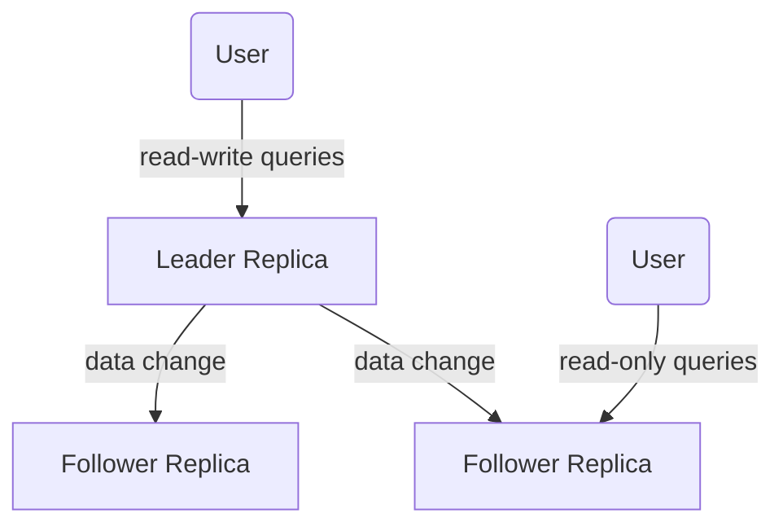

We want [[Replication]] to handle node failure, improve scalability and latency.

In this chapter we assume the dataset can fit within a single machine.

The hard part of replication is **handling changes** to replicated data. 
There are multiple algorithms for replicating changes between nodes: 
- Single-leader
- Multi-leader
- Leaderless

Trade-offs to consider: **synchronous / asynchronous** and **how to handle failed replicas**.

# Leaders and followers / Leader based replication / Single leader

### Synchronous vs Asynchronous replication
In a **Synchronous** case, the leader waits until the follower replica has confirmed that it received the write before reporting success to the user and before making the write visible to the clients.
In an **Asynchronous** case, the leader sends the message to the follower replica but does not wait for a response from the follower.

Usually, we want to have **one** follower to be synchronous and other replicas are asynchronous. AKA **semi-synchronous**. 

### Setting up new followers (replica)
1. Take snapshot of Leader's DB at some point in time. 
2. Copy snapshot to the new follower node
3. The follower requests from leader all the data changes that happened since the snapshot was taken.
4. When done, the follower has `caught up` and is now available.

### Handling node outages
- Follower failure: recovers in the same way as spinning up a new follower
- Leader failure: **TOUGH !**

### Implementation of replication logs
Different approaches
1. Statement based replication (not used anymore)
2. Write ahead log (WAL) shipping
3. Logical (row-based) log replication
4. Trigger-based replication

## Replication Lag
> [!tldr] Eventual Consistency
> With asynchronous followers, due to communication issues or delay, it is possible that a replica has a delayed state compared to the leader, which can last idealy a few seconds but can be more than that (minutes !). *Eventually* the follower will get up to date.

### Reading your own Writes
Due to eventual consistency, a user sending data to the DB, could see that the data got lost if the next request reads from a follower that has not been updated yet. This is awful because the user thinks the data has been lost.

Solutions: **Read your own writes**:
- Read from the leader when the user did a write, if not read from followers
- Use other heuristics. Check what is the replication lags, ...
- Collect timestamp of latest write from client and decide which replica to use. 

### Monotonic reads

If a user queries followers with increasing replication lags, they believe the data is regressing !
> [!tldr] Monotonic reads
> Enforce that the user always see the same state or a later state of the database.
> It is a lesser guarantee than *strong consistency* but stronger than *eventual consistency*
> 
> *eventual consistency* < *monotonic reads* < *strong consistency*

To solve for this, makes sure that the user is using the same replica, using a hash on the user ID for example. If the replica fails, the user needs to be routed to another replica.

### Consistent Prefix Reads
What happens if you read a reply before the question ? Not great user experience.

Preventing this is called *consistent prefix reads*.

> [!tldr] Consistent prefix reads
> If a sequence of writes happens in a certain order, then anyone reading those writes will see them appear in the same order.

# Multi-leader Replication

