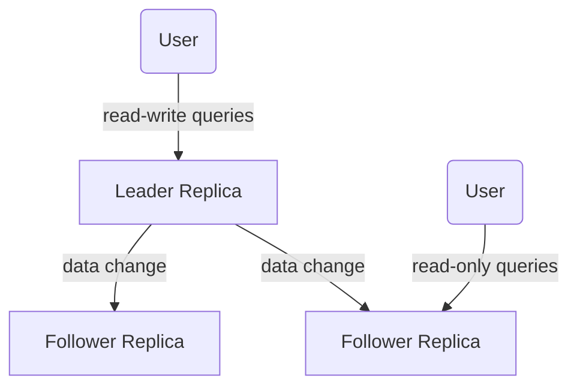

[[Replication]]

In this chapter we assume the dataset can fit within a single machine.

The hard part of replication is **handling changes** to replicated data. 
There are multiple algorithms for replicating changes between nodes: 
- Single-leader
- Multi-leader
- Leaderless

Trade-offs to consider: **synchronous / asynchronous** and **how to handle failed replicas**.

## Leaders and followers / Leader based replication

### Synchronous vs Asynchronous replication
In a **Synchronous** case, the leader waits until the follower replica has confirmed that it received the write before reporting success to the user and before making the write visible to the clients.
In an **Asynchronous** case, the leader sends the message to the follower replica but does not wait for a response from the follower.

Usually, we want to have **one** follower to be synchronous and other replicas are asynchronous. AKA **semi-synchronous**. 

### Setting up new followers (replica)
1. Take snapshot of Leader's DB at some point in time. 
2. Copy snapshot to the new follower node
3. The follower requests from leader all the data changes that happened since the snapshot was taken.
4. When done, the follower has `caught up` and is now available.

### Handling node outages
### Implementation of replication logs
Different approaches
1. Statement based replication (not used anymore)
2. Write ahead log (WAL) shipping
3. Logical (row-based) log replication

