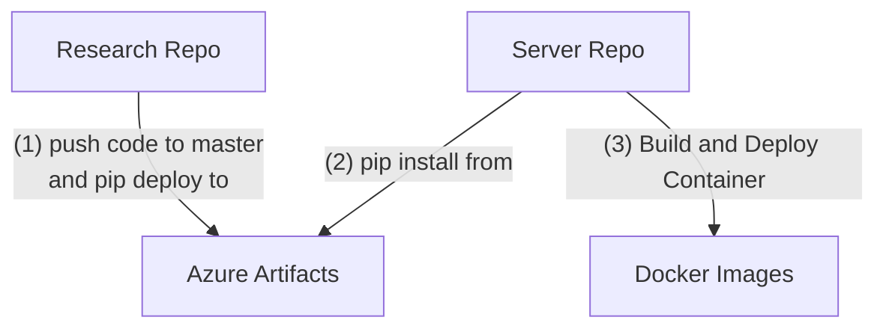

# Hello world
Presented by #ThomasSajot


> [!FAQ] Thomas 
> Some date


---

Hello you

```python
import pandas as pd

def foo(a: str) -> int:
	return int(a)

if __name__ == "__main__":
	foo('120')
```

---
# Something else

- [x] Some important stuff
- [ ] TODO
- [ ] These
- [ ] Title
- [ ] Are 
- [ ] very 
- [ ] Big
- [ ] Don't you think ? 

---
##### One Tool to rule them all
.png)

---
Some mermaid for the ending


